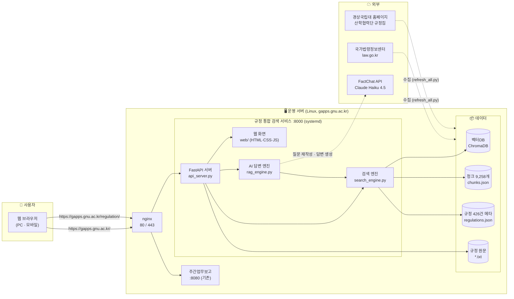
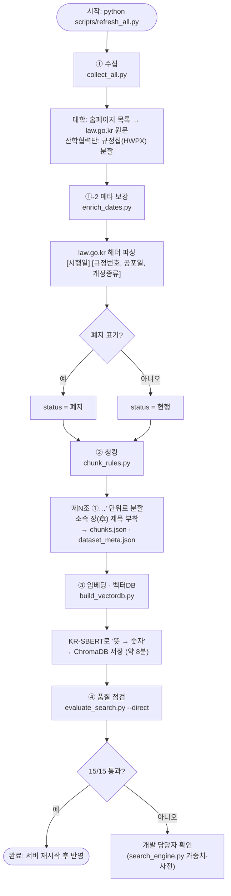
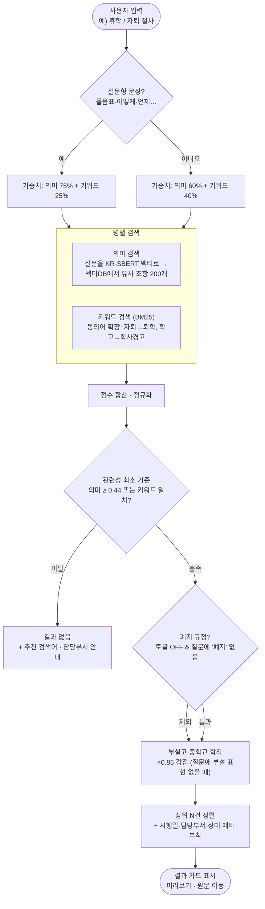
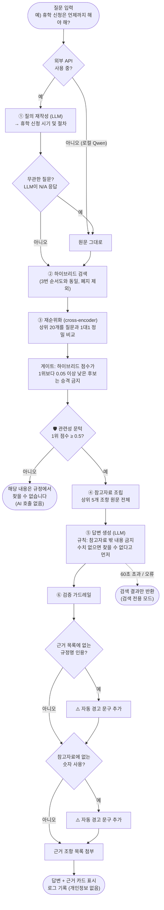
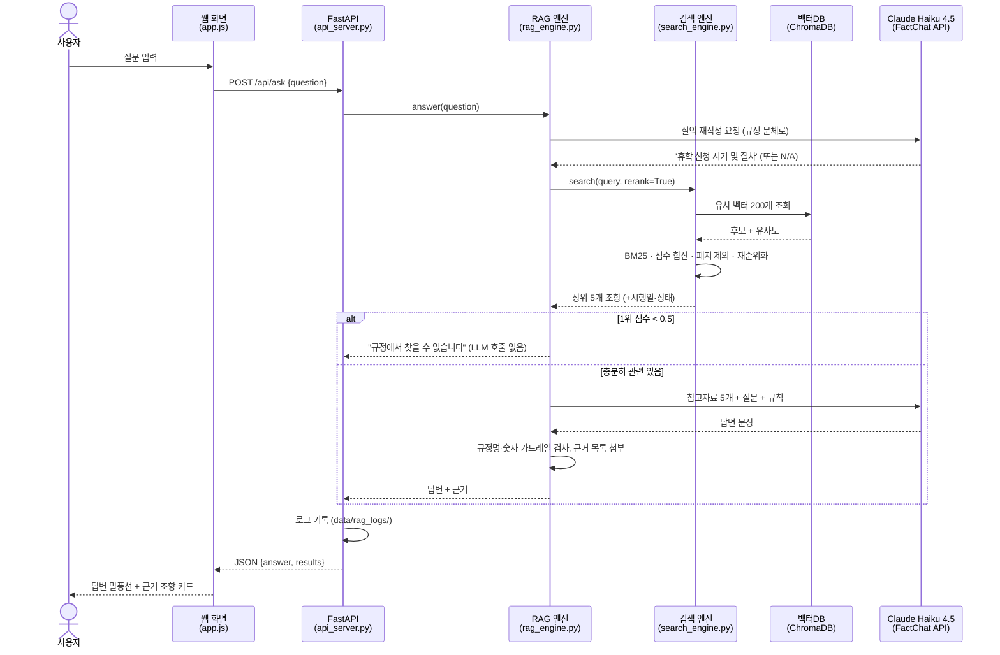
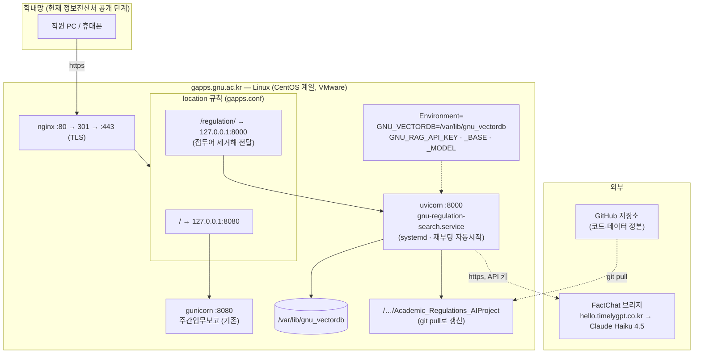
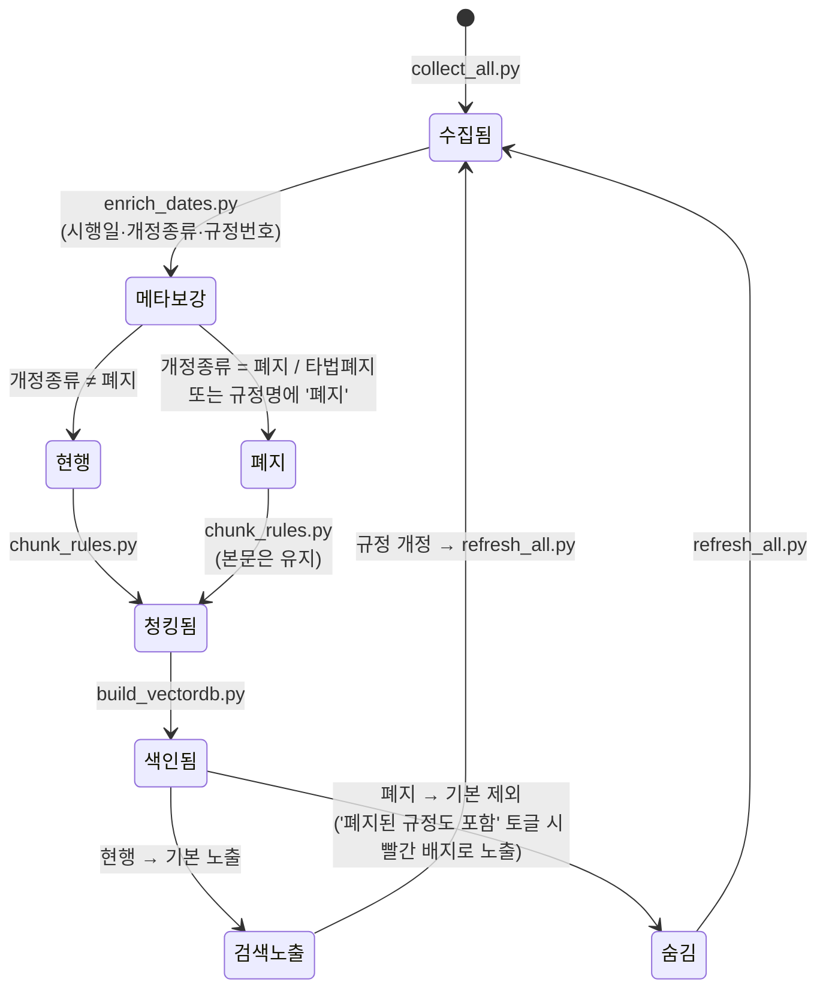
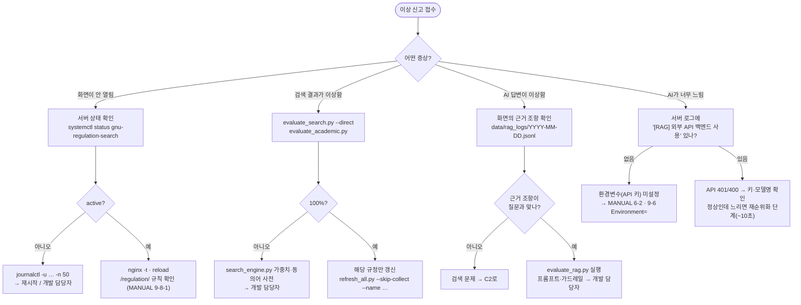

# 그림으로 보는 시스템 — UML · 순서도

> 글보다 그림으로 이해할 수 있게 정리한 문서입니다. 모든 그림은 GitHub에서 바로 렌더링되는
> **Mermaid** 표기(UML 2.x / 순서도 표준 도형)로 작성했습니다.
> VS Code에서는 "Markdown Preview Mermaid Support" 확장을 설치하면 미리보기에서 보입니다.

---

## 1. 전체 구성도 (Component Diagram)

"누가 어디에 있고, 무엇과 연결되는가" — 한 장으로 보는 시스템 뼈대.



---

## 2. 데이터 준비 순서도 (Flowchart) — 규정이 바뀌면 `refresh_all.py` 한 줄



---

## 3. 검색 순서도 (Flowchart) — 🔍 검색 탭, 0.05초



---

## 4. AI 질문하기 순서도 (Flowchart) — 💬 근거만 보고 답하는 AI, 여러 겹의 안전장치



---

## 5. 시퀀스 다이어그램 (Sequence) — AI 질문 한 번에 누가 무엇을 주고받나



---

## 6. 클래스 다이어그램 (Class) — 핵심 모듈과 관계

```mermaid
classDiagram
    direction LR

    class SearchEngine {
        +chunks : list
        +reg_by_id : dict
        +model : SentenceTransformer (KR-SBERT)
        +collection : ChromaDB
        +bm25 : BM25
        -_reranker : CrossEncoder
        +search(query, top_k, sources, categories, rerank, include_repealed) dict
        +get_chunk(chunk_id) dict
        +get_regulation_fulltext(reg_id) dict
        -_lazy_reranker()
        -_minmax_norm()
    }

    class RagEngine {
        <<module>>
        +TOP_N_FOR_CONTEXT = 5
        +MIN_TOP_SCORE_FOR_ANSWER = 0.5
        +answer(query) dict
        +retrieve(query) dict
        +rewrite_query(query, backend) str
        +build_context(search_result) str
        +apply_citation_guardrail(answer) str
        +apply_number_guardrail(answer, context) str
    }

    class LLMBackend {
        <<abstract>>
        +generate(system_prompt, user_prompt) str
        +is_available() bool
    }
    class OpenAICompatibleBackend {
        +api_base : GNU_RAG_API_BASE
        +model_name : GNU_RAG_API_MODEL
        +generate()
    }
    class LocalHFBackend {
        +MODEL_NAME = Qwen2.5-1.5B
        -_generate_lock : Lock
        +generate()
    }

    class ApiServer {
        <<FastAPI>>
        +GET /api/search
        +POST /api/ask
        +GET /api/filters
        +GET /api/chunks/{id}
        +GET /api/regulations/{id}
        +StaticFiles web/
    }

    class Regulation {
        +id, name, source, category
        +department, contact
        +enforce_date, revision_date
        +revision_type, rule_no
        +status : 현행 | 폐지
        +text_file, law_url
    }
    class Chunk {
        +chunk_id, reg_id
        +article, article_title, clause
        +chapter
        +text
    }

    ApiServer --> SearchEngine : 검색 탭
    ApiServer --> RagEngine : AI 질문 탭
    RagEngine --> SearchEngine : retrieve()
    RagEngine --> LLMBackend : generate()
    LLMBackend <|-- OpenAICompatibleBackend
    LLMBackend <|-- LocalHFBackend
    SearchEngine "1" o-- "9,258" Chunk
    SearchEngine "1" o-- "426" Regulation
    Regulation "1" *-- "n" Chunk
```

---

## 7. 배포 다이어그램 (Deployment) — 업무보고 서버와 포트 공유



---

## 8. 상태 다이어그램 (State) — 규정 한 건의 생애



---

## 9. 운영자 의사결정 순서도 — "문제가 생겼을 때 어디를 보나"



---

### 그림 읽는 법 (범례)

| 도형 | 뜻 |
|---|---|
| `([ … ])` 둥근 모서리 | 시작 / 끝 |
| `[ … ]` 사각형 | 처리 단계 |
| `{ … }` 마름모 | 판단(분기) |
| `[( … )]` 원통 | 데이터 저장소 |
| 점선 화살표 | 외부 호출 · 조건부 흐름 |
| 실선 화살표 | 기본 흐름 · 의존 |

관련 문서: [README.md](README.md) (개발 현황·근거) · [MANUAL.md](MANUAL.md) (운영 매뉴얼) · [PRD.md](PRD.md)
